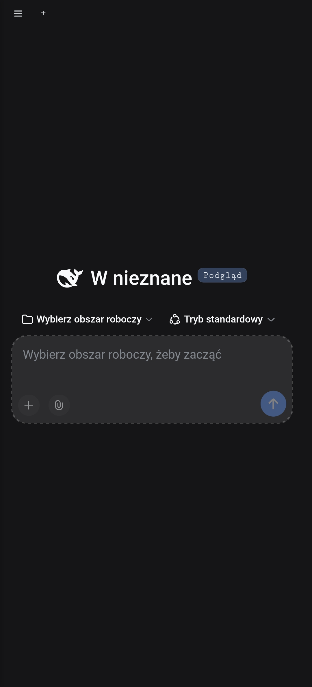
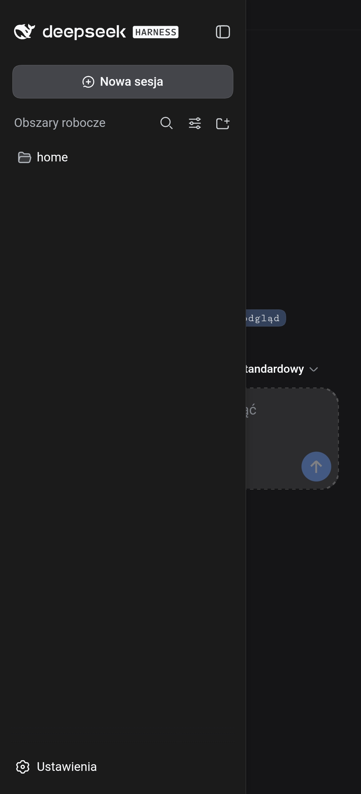

# DSH Mobile: DeepSeek Harness on Android

**English · [Polski](README.pl.md)**

**The whole DeepSeek Harness in a single phone app, no Termux, no root, with a complete developer toolchain, a Polish language pack and a Code screen that opens sessions from your computers.**

A self-contained Android APK that runs the full [DeepSeek Harness](https://github.com/deepseek-ai/deepseek-harness) (Node.js agent harness with a web GUI) on-device, with a bundled toolchain (C/C++ via Zig, JDK 21, Kotlin, Python 3.14, Node 26, jadx, apktool, git, ffmpeg…), a Polish language pack, a curated set of community plugins, Edge TTS, an in-app updater and a **Code** screen that opens DeepSeek Harness sessions from your computers over a **built-in Tailscale node** (tsnet, no VPN app needed; computers running [dsh-remote-control](https://github.com/gangg111/dsh-remote-control) are discovered automatically). Built entirely inside Termux on an arm64 phone.

---

## Screenshots

<p align="center">
  
  
</p>

## What it is

One APK packs:

- **DeepSeek Harness** (`@deepseek-ai/dsh`, web profile) running on the bundled Node.js 26 from Termux,
- a **Polish UI** (language pack through the official dsh locale mechanism, 58 namespaces, 2446 strings, since 1.2.0 covering the new dsh 0.2.0 screens: plugin manager, automation tasks, voice input, sidebar terminal and browser; the UI language follows the system or the Settings → General → Language setting, English stays available),
- **tools for the model**, all on the `PATH` of the bundled `bash`:
  - compilers: `cc`/`gcc`/`clang`/`c++`/`g++` (Zig, producing static binaries that run on Android), JDK 21 (`java`, `javac`, `jar`, `javap`, `jshell`), `kotlinc`, Python 3.14 with pip and numpy, Node 26 with npm/npx, `make`, `cmake`,
  - reverse engineering: `jadx`, `apktool`, `d2j-dex2jar` and the rest of dex2jar, `aapt`, `aapt2`, GNU binutils (`objdump`, `nm`, `readelf`, `strings`, `ar`, `ld`, `as`),
  - system: GNU coreutils, `sed`, `gawk`, `grep`, `find`, `diff`, `patch`, `tar`, `gzip`, `xz`, `bzip2`, `zip`, `unzip`, `rg`, `fd`, `jq`, `tree`, `file`, `curl`, `wget`, `git` (HTTPS), `sqlite3`, `openssl`, `ffmpeg`, `ffprobe`,
- **community plugins**: mobile UI (dsh-qol), cross-session memory, turn rewind with file restore, loop breakers (repeat-stop, tool-budget), 87 reverse-engineering skills, diff-based file editing, clock in context, task list across turns, MCP bridge over stdio, TTS (Edge TTS with Polish voices, parallel synthesis of fragments),
- a **foreground service** that keeps the server alive in the background (notification with “Stop” and “Update” buttons),
- an **in-app updater**: the bundled npm downloads a new dsh version, applies the Android patches from precompiled files, test-starts it and only then swaps the directory.

## Installation

1. Download `dsh-mobile.apk` from [Releases](../../releases) (about 620 MB).
2. Allow your file manager to install from unknown sources and install it.
3. The first launch unpacks about 1.3 GB (60k files) into the app's storage. It takes a few minutes with a progress counter; later launches take seconds.
4. Grant file access: the agent works in `Download` by default, and the app writes its log there (`Download/dsh_log.txt`).
5. Enter your DeepSeek API key in the harness welcome screen.

Requirements: Android 9+ (targetSdk 28 on purpose, see below), arm64, about 2 GB of free space.

## Usage

- The UI runs in the app window; the server listens only on `127.0.0.1:3090` and every launch gets a fresh token.
- Language: Settings → General → Language (Polish by default when the system is Polish, English otherwise).
- Permission mode: the app sets `danger-full-access`, because the Android kernel has neither Landlock nor bubblewrap, and dsh refuses to run commands in sandboxed modes. Android itself isolates the process (app directory plus shared storage).
- TTS: speaker button next to a reply, “Read automatically” toggle in the composer, settings under Settings → Plugins → Voice. Default voice `pl-PL-ZofiaNeural`; `DSH_TTS_EDGE_PARALLEL` sets the number of parallel syntheses (default 30).
- Updating dsh: notification → “Update”. After start the app checks npm and shows the available version.
- `AGENTS.md` from the working directory goes into the model's context.
- The UI is rendered 1.2× larger than in a desktop browser (constant `UI_ZOOM` in `MainActivity.kt`), and the Android status/navigation bars take the page background color.
- **Code** (sidebar): DeepSeek Harness sessions from your computers. First time: “Sign in to Tailscale” (the system browser opens; the app becomes the `dsh-mobile` device in your tailnet). Computers running the [`dsh-remote-control`](https://github.com/gangg111/dsh-remote-control) plugin appear on their own; tapping a session opens it with full history, and messages and photos work as on the PC. “Add device” remains as a manual fallback. When the node is not signed in but the Tailscale app (VPN) is on, the old direct route still works.

## How it works

```
APK
├── assets/payload.zip           (stored, ~610 MB) → unpacked to filesDir/rt on first launch
│   ├── bin/  node bash python3 …  + wrappers (cc, javac, jadx, npm …), dsh-tsnet-mobile
│   ├── lib/  *.so from Termux (NEEDED closure), python3.14/, node_modules/npm
│   ├── opt/  jdk, zig, jadx, apktool, kotlin, dex2jar
│   ├── node_modules/            dsh + plugins (npm)
│   ├── dsh-locale-pl/           plugin with the Polish language pack
│   ├── dsh-code/                Code screen plugin (host + client)
│   ├── android.patch.yml        profile overlay: plugins, system prompt, locale
│   ├── android-shim.cjs         --require: fs.link → copyFile (Android forbids hard links)
│   ├── android-patches/*.mjs    plugin patches (parallel TTS, Polish strings) applied after npm install
│   ├── android-prebuilt/        pty.node, system.node (flock) — precompiled addons
│   ├── android-update.mjs       in-app updater
│   ├── tools.env, links.txt     environment variables and symlinks recreated after unpacking
│   └── etc/tls/cert.pem
├── ServerService                foreground service: node … dsh --profile web --patch rt/android.patch.yml --port 3090
└── MainActivity                 WebView pointed at the server (token read from stdout)
```

Workarounds needed for Termux's Node and dsh to run inside another app:

| Problem | Solution |
|---|---|
| Termux binaries have the prefix `/data/data/com.termux/files/usr` compiled in | `LD_LIBRARY_PATH`, `OPENSSL_CONF=/dev/null`, `SSL_CERT_FILE`, `GIT_EXEC_PATH`, `MAGIC`, `CMAKE_ROOT`… (`tools.env`) |
| since API 29 Android blocks exec and dlopen from the app data directory | `targetSdk 28` (Termux does the same) |
| SELinux forbids hard links (`link()`) | shim replacing `fs.link` with `copyFile(COPYFILE_EXCL)` |
| the `flock` addon exists only for linux/darwin | `flock.c` compiled with clang as `node-addon-system-android-arm64` + loader patch |
| `sharp` has no android-arm64 binary | WebAssembly variant |
| `node-pty` has no prebuild | node-gyp build with `-Dandroid_ndk_path=` |
| no sandbox (Landlock/bwrap) | `DSH_PERMISSION_MODE=danger-full-access` |
| zip does not carry symlinks | `links.txt` recreated with `Os.symlink` |
| scripts with Termux shebangs | `#!/system/bin/sh` + exec through the bundled bash |
| `koffi` version without an android-arm64 binary (dsh ≥ 0.2.0 pins 3.1.1) | `overrides` in package.json to the newest version of the same major line that has the binary |
| after a dsh upgrade npm nests `@deepseek-ai/*` under `@deepseek-ai/dsh/node_modules`, so plugins cannot find `@deepseek-ai/dsh-tools` | `android-hoist.mjs`: top-level symlinks to the nested packages (recreated from `links.txt` in the APK) |
| `node-addon-require-builtin` (dsh ≥ 0.2.0) with no android-arm64 variant and no sources | a JS package `node-addon-require-builtin-android-arm64` that returns internal modules through plain `require()` under `--expose-internals` |

### Code screen and the built-in Tailscale node

`code/dsh-code` is a dsh plugin (host + client). The server starts `bin/dsh-tsnet-mobile` (`tsnet/`, Go, built natively inside Termux with `GOOS=android`): a Tailscale node inside the process, no TUN device, no VPN. The official `tailscaled` does not start on Android because SELinux denies apps access to netlink; the program lists interfaces through `ioctl SIOCGIFCONF` instead. For every computer it opens a local proxy on `127.0.0.1:<fixed port>` and forwards HTTP and WebSocket traffic to `https://<pc>.ts.net` (Host/Origin rewritten to the computer's address, Location rewritten back to the local one, Set-Cookie without Secure). Entering the proxy requires a secret generated at every start (passed to the program only through an environment variable), then an HttpOnly SameSite=Strict session cookie; the server uses the `X-DSH-Secret` header; anything else gets 403. Tailnet devices are probed (`/__remote/api/info`, 4 s timeout, `dsh-*` names first, up to 4 at a time; failed probes are retried after 30 s, 2 min and 10 min, then only when the device's online state changes) and those running `dsh-remote-control` are added to `dsh-code.json` in the app directory, which survives updates. On the PC side you need the [`dsh-remote-control`](https://github.com/gangg111/dsh-remote-control) plugin (separate repository: a DSH gateway behind Tailscale that admits only your account) and “HTTPS Certificates” enabled in the tailnet admin console.

## Building from source (Termux, arm64)

Requirements: Termux with `nodejs` (26), `python` (3.14), `clang`, `openjdk-21`, `golang`, `git`, `zip`, `aapt2`, `apksigner`, Gradle through the project wrapper, and the packages of the tools copied into the payload (`binutils`, `ripgrep`, `fd`, `jq`, `tree`, `file`, `ffmpeg`, `sqlite`, `kotlin`, `dex2jar`, `cmake`, `make`, `python-numpy`…). Gradle/aapt2 pitfalls on Termux are described in `app/gradle.properties`.

```sh
# 1. install dsh with the Android patches (once; update.sh does it afterwards)
mkdir ~/dsh-test && cd ~/dsh-test && npm init -y && npm install --ignore-scripts --force @deepseek-ai/dsh
# 2. the toolchain from Termux + downloaded archives (zig, jadx, apktool) -> tools/root
tools/build-tools.sh
# 3. full run: npm -> native patches -> runtime -> language pack -> Tailscale node (Go) -> payload -> APK
./update.sh                 # options: --tag alpha|X.Y.Z  --skip-npm  --force  --debug
```

`update.sh` writes the signed APK to `/sdcard/Download/dsh-mobile.apk`. The release signature uses the key `~/.android/ciuchy-release.jks` (alias `ciuchy`, password in `~/.android/ciuchy-release.pass`); change `signingConfigs` in `app/app/build.gradle.kts` to your own key or use `--debug`.

Tests: `tools/test-tools.sh <rt>` (38 toolchain tests in a clean environment), `go test ./...` in `tsnet/`, `node --test` in `code/dsh-code`. Before packaging, `update.sh` test-starts dsh on the staged runtime.

## Translation

- dsh UI: `locale-pl/pl-1..4.json` → `pl.json` → `build-plugin.mjs` → plugin `@dsh-local/locale-pl`. After a dsh update, missing keys fall back to English; `update.sh` prints the list of untranslated keys.
- Community plugins do not use the dsh locale mechanism (hard-coded Chinese strings or their own zh/en dictionaries), so they are localized by the patches `android-patches/{qol,rewind,tts}-polish.mjs`. When an author changes a string, the patch stops the update with a message so that Chinese strings never slip through silently.

## Limitations

- The app has no package manager: pip builds only pure-Python packages, npm installs only packages without native parts.
- The in-app updater requires the same `node-pty` version as the precompiled one; otherwise it points to `update.sh` in Termux (where the compiler is).
- With 30 parallel connections and very long replies, Microsoft may reject some of them; the plugin retries the fragment and skips it as a last resort.
- Size: APK about 620 MB, about 1.3 GB unpacked; about 2 GB of free space including the APK.
- dsh 0.2.0 disables the `dsh-memory-connect` (cross-session memory) and `dsh-reverse-skill` (reverse-engineering skills) plugins as incompatible: their authors declare compatibility with dsh 0.1.x only. They come back once compatible versions appear.
- Code screen: the proxy can only be entered from the Code screen (SameSite=Strict cookie), and the computer needs “HTTPS Certificates” enabled in the tailnet, otherwise `tls: internal error`.

## Component licenses

This app's code: MIT. The APK contains third-party software under its own licenses:

| Component | License |
|---|---|
| DeepSeek Harness and `@deepseek-ai/*` plugins | MIT |
| Node.js, npm | MIT / Artistic 2.0 |
| OpenJDK 21 (Termux) | GPLv2 with Classpath Exception |
| Zig | MIT |
| Kotlin | Apache 2.0 |
| jadx, apktool | Apache 2.0 |
| dex2jar | Apache 2.0 |
| Python 3.14, numpy | PSF / BSD |
| bash, coreutils, findutils, grep, sed, gawk, diffutils, patch, tar, gzip, make, binutils, wget (Termux) | GPLv3 |
| git | GPLv2 |
| Tailscale (`tsnet`) and the Go libraries of `dsh-tsnet-mobile` | BSD-3-Clause; dependencies under their own licenses (BSD/MIT/Apache 2.0) |
| ffmpeg | LGPL/GPL (Termux build) |
| curl, openssl, sqlite, zip/unzip, xz, bzip2, jq, ripgrep, fd, tree, file, cmake | their own licenses (MIT/BSD/zlib and similar) |
| dsh community plugins (dsh-qol, dsh-memory-connect, dsh-turn-rewind, dsh-reverse-skill, dsh-patch-edit-plus, dsh-repeat-stop, dsh-tool-budget, dsh-clock-context, dsh-todo-continuity, dsh-mcp-bridge, dsh-plugin-tts) | per their authors' repositories (MIT) |

Binaries come from Termux packages (https://github.com/termux/termux-packages) and the official releases of Zig, jadx and apktool.

## Repository layout

```
app/            Gradle project (Kotlin): App.kt, ServerService.kt, MainActivity.kt
stage/          runtime and payload files (without node_modules — those live in ~/dsh-test)
tools/          build-tools.sh, merge-tools.sh, apply-links.sh, test-tools.sh, root/ (output)
locale-pl/      Polish language pack: extract-en.mjs, pl-*.json, build-plugin.mjs, android.patch.yml
code/dsh-code/  Code screen plugin (host: index.js, tsnet.js, discover.js; client: client.js; node tests)
tsnet/          dsh-tsnet-mobile: built-in Tailscale node in Go (tsnet, proxy, control API, tests)
tap-outside/    plugin closing the sidebar by tapping next to it
update.sh       full build and update pipeline
```
